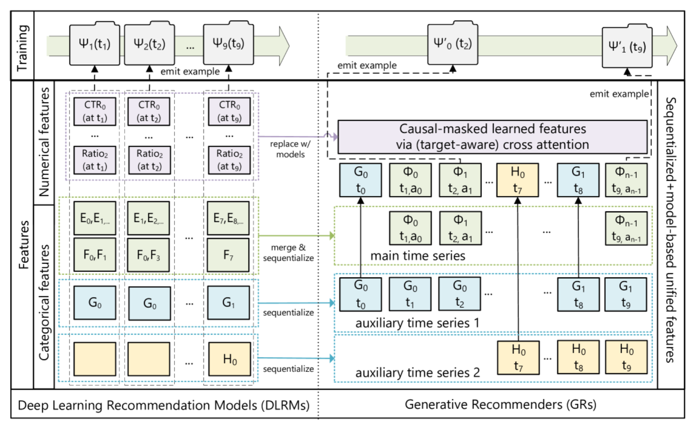
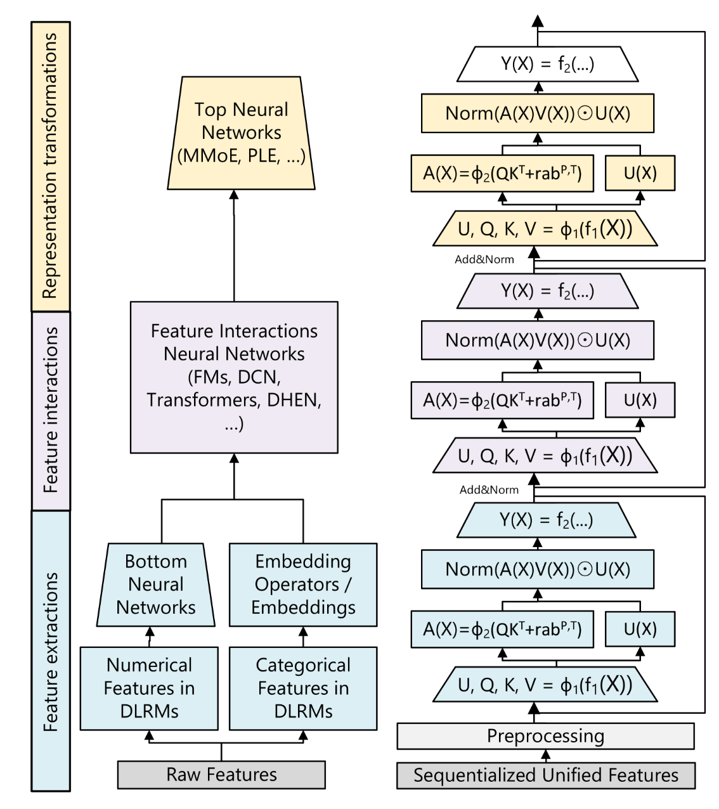

# 生成式推荐模型学习笔记

这份笔记围绕五个模型/框架展开：

- TIGER
- HSTU / Generative Recommenders
- OneRec
- RankMixer
- UniRec

阅读方式建议：

1. 先看每节的“模型定位”，知道它在推荐链路里解决什么问题。
2. 再看“模型结构”，对照论文图理解模块关系。
3. 最后看“输入输出 + 数据流”，把它讲成一条完整 pipeline。

---

## 1. TIGER


### 1.1 模型定位

TIGER 的全称可以理解为 **Transformer Index for Generative Recommenders**。它主要解决的是推荐系统里的 **召回 / candidate generation** 问题。

传统召回通常是：

```text
user embedding
    ↓
ANN / nearest neighbor search
    ↓
top-K item embeddings
```

TIGER 换了一种思路：

```text
用户历史 item 序列
    ↓
转成 Semantic ID token 序列
    ↓
Encoder-Decoder Transformer
    ↓
生成下一个 item 的 Semantic ID
    ↓
Semantic ID 映射回真实 item
```

所以 TIGER 的核心不是做排序，而是把召回改写成一个 **生成 item Semantic ID** 的问题。

一句话：

> TIGER = Semantic ID tokenizer + Seq2Seq Transformer generative retrieval。

### 1.2 模型结构

TIGER 可以拆成两个模块：

```text
1. Semantic ID Generation
   item content → content encoder → embedding → quantization → Semantic ID

2. Generative Retrieval Model
   user history Semantic IDs → Transformer Encoder-Decoder → next item Semantic ID
```

第一个模块负责给 item 建立可生成的离散 ID。

第二个模块负责根据用户历史生成下一个 item 的 ID。

### 1.3 输入输出

训练阶段输入：

```text
用户历史交互序列:
u, item_1, item_2, ..., item_t

每个 item 的 Semantic ID:
item_i → (c1, c2, c3)
```

训练目标：

```text
预测下一个 item 的 Semantic ID:
item_{t+1} → (c1, c2, c3)
```

推理阶段输入：

```text
用户当前历史行为序列
```

推理阶段输出：

```text
候选 Semantic ID
    ↓
映射回真实 item
    ↓
召回候选列表
```

### 1.4 数据流

完整数据流可以分成三段。

第一段，离线构造 Semantic ID：

```text
Item metadata / content
        ↓
Content Encoder
        ↓
Item embedding
        ↓
Quantization
        ↓
Semantic ID table
        ↓
item_id ↔ semantic_id
```

第二段，训练生成式召回模型：

```text
User behavior sequence
        ↓
Replace each item with Semantic ID tokens
        ↓
Bidirectional Transformer Encoder
        ↓
Encoded context
        ↓
Transformer Decoder
        ↓
Predict next item Semantic ID
        ↓
Cross-entropy loss over generated code tokens
```

第三段，线上召回：

```text
User recent behavior sequence
        ↓
Convert history items to Semantic ID tokens
        ↓
Encoder encodes user history
        ↓
Decoder generates candidate Semantic IDs
        ↓
Beam search / constrained decoding
        ↓
Map Semantic IDs back to item IDs
        ↓
Candidate recall list
```

### 1.5 对着图怎么讲

你可以按论文图的左右两部分讲。

左半边是 **Semantic ID generation**：

```text
Item Content Information
    ↓
Content Encoder
    ↓
Embedding
    ↓
Quantization
    ↓
Semantic ID
```

这里要强调：TIGER 不直接生成原始 item ID，而是先把 item 变成有语义结构的离散 token 序列。

右半边是 **Transformer Encoder-Decoder**：

```text
用户历史 item
    ↓
替换成 Semantic ID tokens
    ↓
Bidirectional Transformer Encoder
    ↓
Encoded Context
    ↓
Transformer Decoder
    ↓
生成 Next Item 的 Semantic ID
```

比如图里：

```text
Item 233 → Sem.ID = (5, 23, 55)
Item 515 → Sem.ID = (5, 25, 78)

Decoder 生成:
Item 64 → Sem.ID = (5, 25, 55)
```

### 1.6 关键点

- Semantic ID 是 TIGER 的核心，不是普通 item ID。
- Semantic ID 由内容 embedding 量化得到，所以相似 item 可能共享部分 code。
- Transformer Decoder 生成的是一个 ID token 序列，而不是直接输出 item embedding。
- TIGER 更像生成式召回模型，而不是完整推荐系统。

### 1.7 局限

- 主要解决 retrieval，不直接解决 rank / rerank。
- Semantic ID 质量依赖 content encoder 和 quantization。
- 如果多个 item 共享同一个 Semantic ID，需要额外 disambiguation。
- 生成式 beam search 的线上成本需要考虑。

---

## 2. HSTU / Generative Recommenders

HSTU 来自 Meta 的 **Generative Recommenders** 工作。它和 TIGER 的侧重点不同。

TIGER 重点是：

```text
如何生成 item Semantic ID
```

HSTU 重点是：

```text
如何把工业推荐数据建模成可扩展的用户行为序列
```

也就是说，HSTU 更像一个推荐系统里的 **sequence backbone**。

---

### 2.1 HSTU 图一：从 DLRM 到 Generative Recommender



### 2.2 模型定位

传统 DLRM 更像是：

```text
numerical features
categorical features
user/item/context features
        ↓
feature interaction network
        ↓
prediction head
```

HSTU / Generative Recommenders 想把推荐数据改写成：

```text
用户行为流
    ↓
序列化统一特征
    ↓
causal sequence modeling
    ↓
预测未来 action / item / target
```

所以它不是单纯做 next item ID generation，而是把用户在平台上的行为建模成一个时间序列。

### 2.3 图一怎么讲

图左边是传统 DLRM 的处理方式。

```text
Numerical features
Categorical features
        ↓
在不同时间点分别建模
        ↓
特征交互网络
        ↓
训练样本 / prediction target
```

图右边是 Generative Recommenders 的处理方式。

```text
main time series
auxiliary time series 1
auxiliary time series 2
        ↓
merge & sequentialize
        ↓
causal-masked learned features
        ↓
target-aware cross attention
        ↓
emit example
```

重点是：  
HSTU 把原来散落在 feature table 里的特征，变成了一个 **sequentialized + model-based unified feature**。

### 2.4 输入输出

输入：

```text
用户行为序列:
(action_type, item_id, timestamp, surface, context, features)
```

比如：

```text
t1: view item A on feed
t2: like item B
t3: skip item C
t4: click item D
```

输出：

```text
未来行为预测
未来 item 预测
多任务目标预测
```

它可以服务于：

- candidate generation
- ranking feature
- multi-task prediction
- user state modeling

### 2.5 图一数据流

```text
Raw user events
        ↓
Numerical / categorical / contextual features
        ↓
Merge and sequentialize
        ↓
Main time series + auxiliary time series
        ↓
Causal-masked learned features
        ↓
Target-aware cross attention
        ↓
Emit training examples / future targets
```

---

### 2.6 HSTU 图二：HSTU Block / Backbone



### 2.7 模型结构

图二右边是 HSTU 的主干结构。

它的输入是：

```text
Sequentialized Unified Features
```

先经过：

```text
Preprocessing
```

然后进入多层 HSTU-like block。

从图里可以看到每层包含：

```text
U, Q, K, V = φ1(f1(X))
        ↓
A(X) = φ2(QK^T + relative bias)
        ↓
Norm(A(X)V(X) ⊙ U(X))
        ↓
Y(X) = f2(...)
```

你汇报时不需要展开公式细节，可以解释成：

```text
输入序列 X
    ↓
生成 query/key/value/update 表示
    ↓
做时间序列上的交互
    ↓
用 U(X) 做 gating/update
    ↓
输出新的序列表示 Y(X)
```

### 2.8 HSTU 输入输出

输入：

```text
serialized unified features
```

也就是用户行为、item、上下文、时间等组成的序列。

中间输出：

```text
每个时间步的 hidden state
```

最终输出：

```text
top prediction heads
```

可以用于预测未来行为、点击、观看时长、互动等。

### 2.9 HSTU 数据流

```text
Raw recommendation logs
        ↓
Feature extraction
        ↓
Feature sequentialization
        ↓
Serialized unified features
        ↓
Preprocessing
        ↓
HSTU layers
        ↓
Sequence hidden states
        ↓
Prediction heads
        ↓
Future action / recommendation target
```

### 2.10 HSTU 关键点

- HSTU 的核心不是 SID，而是 **用户行为序列建模**。
- 它把推荐系统从 feature interaction pipeline 推向 sequence modeling pipeline。
- 输入是行为流，不是单个 user-item pair。
- 它更接近推荐系统里的 foundation backbone。

### 2.11 HSTU 局限

- 系统复杂度和训练成本高。
- 对数据组织方式要求高，需要把多源行为和特征统一成序列。
- 不像 TIGER / OneRec 那样直观地产生 item Semantic ID。
- 更偏工业大规模 backbone，不容易小规模复现。

---

## 3. OneRec


### 3.1 模型定位

OneRec 是快手提出的端到端生成式推荐框架。它的目标比 TIGER 更激进。

TIGER 主要做：

```text
生成式召回
```

OneRec 想做：

```text
用户历史 + 上下文
        ↓
生成式模型
        ↓
直接生成一个推荐 session
```

也就是说，OneRec 想替代传统推荐系统里的多阶段 cascade：

```text
Recall → Pre-rank → Rank → Re-rank
```

改成：

```text
User behavior sequence
        ↓
OneRec
        ↓
High-value session
```

### 3.2 模型结构

OneRec 图分成两部分：

```text
(a) The Architecture of OneRec
(b) Iterative Preference Alignment
```

上半部分是生成模型本体：

```text
OneRec Encoder
        ↓
Hidden representation H
        ↓
OneRec Decoder
        ↓
High-value session tokens
```

下半部分是偏好对齐：

```text
Training Data
        ↓
OneRec_t
        ↓
Beam Search
        ↓
Reward Model
        ↓
chosen / rejected
        ↓
DPO Training
        ↓
OneRec_{t+1}
```

### 3.3 OneRec Encoder

图左上是 **OneRec Encoder**。

输入是用户行为序列：

```text
User Behavior Sequences H_u
```

在图中表现为：

```text
SEP, <a_6>, <b_1>, <c_5>, SEP, <a_2>, <b_1>, <c_7>
```

这里 `<a_6> <b_1> <c_5>` 可以理解为视频 item 的 Semantic ID token。

Encoder 内部结构：

```text
Fully Visible Self-Attention
        ↓
Add & RMS Norm
        ↓
Feed Forward
```

Encoder 的输出：

```text
H
```

也就是用户兴趣表示。

### 3.4 OneRec Decoder

图右上是 **OneRec Decoder**。

Decoder 输入是 high-value sessions：

```text
BOS, <a_9>, <b_7>, <c_1>, ..., BOS, <a_4>, <b_5>, <c_4>
```

Decoder 内部结构：

```text
Causal Self-Attention
        ↓
Fully Visible Cross-Attention
        ↓
Add & RMS Norm
        ↓
MoE Layer
        ↓
Output tokens
```

其中 cross-attention 的 key/value 来自 Encoder 输出的 `H`。

所以数据流是：

```text
用户历史 → Encoder → H
                       ↓
Decoder cross-attention 读取 H
                       ↓
生成 session token
```

### 3.5 MoE Layer

Decoder 里有 MoE Layer：

```text
Router
    ↓
Expert 1 / Expert 2 / Expert 3 / Expert 4 / ...
    ↓
combine
```

MoE 的作用是扩大模型容量，让不同 token / 样本路由到不同 experts。

在推荐场景中，不同用户兴趣、不同视频类型、不同 session 模式可能需要不同子网络建模。

### 3.6 Iterative Preference Alignment

OneRec 下半图是偏好对齐。

流程是：

```text
Training Data
        ↓
OneRec_t
        ↓
Beam Search 生成多个候选 session
        ↓
Reward Model 给每个 session 打分
        ↓
Select chosen / rejected
        ↓
DPO Training
        ↓
OneRec_{t+1}
```

这个过程类似 LLM 的偏好对齐，只是对象从文本回答变成了推荐 session。

### 3.7 输入输出

输入：

```text
用户行为序列
用户上下文
历史观看 / 点击 / 互动 item 的 Semantic ID
```

输出：

```text
一个 high-value session
```

也就是多个推荐视频的 SID 序列。

例如：

```text
Input:
用户历史行为 token

Output:
<a_9><b_7><c_1>, <a_4><b_5><c_4>, ...
```

这些 token 再映射回真实视频 item。

### 3.8 OneRec 数据流

训练主流程：

```text
User behavior sequences
        ↓
Video Semantic ID tokens
        ↓
OneRec Encoder
        ↓
User interest representation H
        ↓
OneRec Decoder
        ↓
Generate high-value session tokens
        ↓
NTP loss
```

偏好对齐流程：

```text
Training data
        ↓
Current OneRec model
        ↓
Beam search candidate sessions
        ↓
Reward model scoring
        ↓
chosen / rejected sessions
        ↓
DPO training
        ↓
Updated OneRec model
```

线上推理：

```text
User history
        ↓
Encode user interest
        ↓
Decoder autoregressively generates session SID
        ↓
Map SID to videos
        ↓
Recommended session
```

### 3.9 对着图怎么讲

你可以这样讲：

1. 左上角是 Encoder，负责读用户行为序列。
2. Encoder 输出 `H`，作为用户兴趣表示。
3. 右上角是 Decoder，先做 causal self-attention，再通过 cross-attention 读取 `H`。
4. Decoder 后面接 MoE Layer，提高模型容量。
5. 最上方输出 high-value session 的 token，并用 NTP loss 训练。
6. 下方是偏好对齐：beam search 生成多个 session，reward model 选 preferred pair，DPO 训练下一轮模型。

### 3.10 关键点

- OneRec 是 session-wise generation，不只是 next-item prediction。
- Encoder 建模用户历史，Decoder 生成推荐 session。
- Cross-attention 是用户兴趣和生成 session 之间的连接。
- MoE 用来扩展模型容量。
- IPA / DPO 把生成结果和用户偏好对齐。

### 3.11 局限

- 系统复杂，训练和 serving 成本较高。
- 需要高质量 session 数据和 reward model。
- 生成式 session 的可控性和线上延迟需要工程优化。
- SID tokenizer 的质量仍然非常关键。

---

## 4. RankMixer


### 4.1 模型定位

RankMixer 严格来说不是生成式召回模型。它更像是推荐系统 **ranking stage 的大模型化 backbone**。

为什么放在生成式推荐调研里？

因为即使 TIGER / OneRec 可以生成候选 item 或 session，工业推荐系统通常仍然需要 ranking 模型来做精细排序。

RankMixer 解决的问题是：

```text
ranking 里有大量异质特征
user profiles
video features
sequence features
interacted features

如何高效做大规模 feature interaction？
```

### 4.2 模型结构

图左边是 RankMixer 主干：

```text
User Profiles
Video Features
Sequence Features
Interacted Features
        ↓
Tokenization
        ↓
T × D feature tokens
        ↓
RankMixer Block × L
        ↓
Mean pooling
        ↓
RankMixer output
        ↓
finish / skip / like / ...
```

图右边展开了两个模块：

```text
1. Token Mixing
2. SMoE variant of PFFN
```

### 4.3 输入输出

输入：

```text
User profile features
Item / video features
Behavior sequence features
Cross / interacted features
```

经过 tokenization 后变成：

```text
T feature tokens
每个 token 是 D 维
所以输入矩阵是 T × D
```

输出：

```text
ranking prediction targets
```

比如：

```text
finish
skip
like
click
duration
conversion
```

### 4.4 RankMixer Block

RankMixer Block 的主流程：

```text
Feature tokens
        ↓
Token Mixing
        ↓
Add & Norm
        ↓
Per-token FFN
        ↓
Add & Norm
        ↓
Output feature tokens
```

这和 Transformer 有点像，但它不用标准 self-attention 来做 token 交互。

原因是推荐特征非常异质：

```text
user id
item category
video author
historical behavior
statistical feature
context feature
```

这些 token 之间不一定适合用自然语言里的 attention 相似度来建模。

RankMixer 用 **Token Mixing** 做更硬件友好、更适合推荐特征的交互。

### 4.5 Token Mixing

图右下角是 Token Mixing。

它大概做的是：

```text
T tokens × D dim
        ↓
Split into H heads
        ↓
在 token/head 维度重组
        ↓
Merge back
        ↓
H tokens / mixed tokens
```

你可以把它理解为：

> 不通过 attention score，而是通过结构化的维度切分和重排，让不同 feature tokens 发生信息混合。

### 4.6 Per-token FFN / Sparse-MoE PFFN

图左中间是 Per-token FFN。

普通 Transformer 的 FFN 通常对所有 token 共享参数：

```text
same FFN for all tokens
```

RankMixer 的想法是：

```text
不同 feature token 用不同 FFN / 专家
```

因为推荐特征的语义差异很大：

```text
user token
item token
sequence token
context token
```

共享一个 FFN 可能表达力不足。

图右上角是 Sparse-MoE variant of PFFN：

```text
ReLU Routing
        ↓
Sparse-MoE
        ↓
PFFN experts
        ↓
output
```

### 4.7 数据流

```text
Raw ranking features
        ↓
Feature embedding
        ↓
Tokenization
        ↓
T × D feature token matrix
        ↓
Token Mixing
        ↓
Add & Norm
        ↓
Per-token FFN / Sparse-MoE PFFN
        ↓
Add & Norm
        ↓
Repeat L layers
        ↓
Mean pooling
        ↓
Prediction heads
        ↓
ranking scores
```

### 4.8 对着图怎么讲

你可以按三块讲：

第一块，底部输入：

```text
User Profiles / Video Features / Sequence Features / Interacted Features
```

这些先 tokenization 成 `T × D` 的 feature tokens。

第二块，左侧主干：

```text
Token Mixing
    ↓
Per-token FFN
    ↓
RankMixer output
```

第三块，右侧展开：

```text
Token Mixing 如何 split / merge
Sparse-MoE PFFN 如何通过 routing 选择 expert
```

### 4.9 关键点

- RankMixer 是 ranking backbone，不是生成式召回模型。
- 它把推荐 ranking 特征组织成 tokens。
- 用 Token Mixing 替代或弱化 self-attention 的角色。
- 用 Per-token FFN / Sparse-MoE 提升异质特征表达能力。
- 目标是让 ranking model 也能 scale up。

### 4.10 局限

- 它不直接生成推荐列表。
- 需要依赖已有候选集。
- 模型结构偏工业 ranking，和 SID/tokenizer 关系不如 TIGER/OneRec/UniRec 直接。
- 对特征工程和线上 serving 系统依赖较强。

---

## 5. UniRec


### 5.1 模型定位

UniRec 关注的是生成式推荐的一个关键问题：

```text
生成式模型只生成 SID，是否会丢失 item-side feature crossing 能力？
```

传统 discriminative ranker 可以直接看很多 item 特征：

```text
category
brand
seller
price
content
historical stats
```

然后和 user features 做 crossing。

但是普通 generative recommender 可能只是：

```text
p(s0, s1, s2 | user)
```

这样生成的是 SID token，item-side features 显式参与得不够。

UniRec 的解决方案是：

```text
先生成 item attributes
再生成 item Semantic ID
```

也就是 **Chain-of-Attribute, CoA**。

### 5.2 模型结构

UniRec 图可以分成三层：

```text
1. Tokenization: Capacity-constrained Semantic ID
2. UniRec Architecture
3. Alignment: RFT / DPO
```

### 5.3 第一层：Capacity-constrained Semantic ID

图最上面是 tokenizer。

流程：

```text
Multimodal Embedding
        ↓
RQ-KMeans
        ↓
codebook0 / codebook1 / codebook2
        ↓
Semantic ID
```

普通 RQ-KMeans 可能出现一个问题：

```text
热门 item 太多挤到相同或相近 code path
```

UniRec 加了 capacity constraint：

```text
V_k ≤ τ C_cap
```

直观理解：

> 每个 code path 的容量不能无限拥挤，要避免热门 item 导致 token path collapse。

如果某些路径 overlap 太严重，就 repair。

### 5.4 第二层：UniRec Architecture

图中间是主模型。

左边输入：

```text
User Sequence
SID Sequence
```

它们作为：

```text
K & V
```

进入 **Gated-CrossAttn**。

主干结构：

```text
Query prefix
        ↓
RMSNorm
        ↓
Gated-CrossAttn
        ↓
RMSNorm
        ↓
MMoE-FFN
```

右边是 **Hierarchical Rank Head**。

这里是 UniRec 的重点。

它不是直接生成：

```text
s0, s1, s2
```

而是生成：

```text
bos, a1, a2, a3, s0, s1, s2
```

其中：

```text
a1, a2, a3
```

可以理解为 item attributes，比如 category、seller、brand 等。

### 5.5 Chain-of-Attribute

普通生成式推荐：

```text
p(s0, s1, s2 | user)
```

UniRec：

```text
p(a1, a2, a3 | user)
× p(s0, s1, s2 | user, a1, a2, a3)
```

也就是：

```text
先生成属性链
再生成 Semantic ID
```

这样做的好处是：

- 生成路径更有语义；
- 属性先验能缩小候选空间；
- item-side features 能显式进入生成过程；
- 更接近 discriminative ranker 的 feature crossing 能力。

### 5.6 Content Summary / CDC

图右侧有 content summary。

它用：

```text
s0
s1
(s0, s1)
hash0 / hash1 / hash2
shared table
```

来构造条件解码上下文。

作用是：

```text
让模型不仅知道当前生成到哪个 token，
还知道这个 token path 对应的内容语义摘要。
```

这有助于后续生成更稳定。

### 5.7 第三层：Alignment

图最下面是训练对齐：

```text
NTP Loss
Preference Pair
        ↓
Reweight
layer-wise Stop Gradient
        ↓
RFT Loss
DPO Loss
        ↓
L = L_RFT + λ_DPO L_DPO
```

可以理解为三类目标：

```text
NTP:
学习生成 attribute + SID 路径

RFT:
按照业务价值对训练样本加权

DPO:
用偏好对做直接偏好优化
```

### 5.8 输入输出

输入：

```text
User behavior sequence
SID sequence
Static profile
Behavior sequence features
SID-level multimodal features
```

输出：

```text
attribute tokens:
a1, a2, a3

Semantic ID tokens:
s0, s1, s2

最终 item candidates
```

### 5.9 数据流

离线 tokenizer：

```text
Item multimodal embedding
        ↓
RQ-KMeans
        ↓
Capacity-constrained codebooks
        ↓
Semantic ID
```

模型训练：

```text
User sequence + SID sequence
        ↓
Gated-CrossAttn backbone
        ↓
Hierarchical Rank Head
        ↓
Generate attributes
        ↓
Generate SID tokens
        ↓
NTP / RFT / DPO losses
```

推理：

```text
User context
        ↓
Generate attribute chain
        ↓
Generate Semantic ID path
        ↓
Map SID to item
        ↓
Candidate items / recommendation list
```

### 5.10 对着图怎么讲

你可以按三层讲。

第一层，上方 tokenizer：

```text
多模态 item embedding
    ↓
RQ-KMeans
    ↓
capacity-constrained Semantic ID
```

第二层，中间 architecture：

```text
User Sequence / SID Sequence
    ↓
Gated-CrossAttn
    ↓
MMoE-FFN
    ↓
Hierarchical Rank Head
    ↓
attribute + SID generation
```

第三层，下方 alignment：

```text
NTP loss
RFT loss
DPO loss
```

最后强调：

> UniRec 的核心不是单纯生成 SID，而是用 Chain-of-Attribute 先生成属性，再生成 SID，从而补足生成式推荐对 item-side features 的表达能力。

### 5.11 关键点

- UniRec 关注生成式推荐和判别式 ranking 的表达差距。
- CoA 是核心：先生成 attributes，再生成 SID。
- Capacity-constrained SID 用来缓解 token path 拥挤。
- Gated-CrossAttn 连接用户序列和生成 prefix。
- RFT + DPO 用来做业务价值和偏好对齐。

### 5.12 局限

- 结构复杂，训练目标多。
- 需要高质量 item attribute 和 multimodal embedding。
- CoA 的 attribute 设计会影响性能。
- 仍然依赖 SID tokenizer 质量。

---

## 6. 五个模型的横向理解

### 6.1 它们分别改写推荐链路的哪里

```text
TIGER
    改写 retrieval：用 Transformer 生成 Semantic ID 召回候选。

HSTU
    改写 user behavior modeling：把推荐数据序列化，做工业级 sequence backbone。

OneRec
    改写 cascade pipeline：从用户历史直接生成 high-value session。

RankMixer
    改写 ranking backbone：把 ranking 特征 token 化，用 mixing block 做特征交互。

UniRec
    改写 generative ranking / retrieval 表达：先生成 attributes，再生成 SID。
```

### 6.2 重点对比

| 模型 | 核心结构 | 输入 | 输出 | 主要作用 |
|---|---|---|---|---|
| TIGER | Semantic ID + Seq2Seq Transformer | 用户历史 SID token | next item SID | 生成式召回 |
| HSTU | Sequentialized features + HSTU layers | 用户行为流 | future action / hidden state | 工业序列 backbone |
| OneRec | Encoder-Decoder + MoE + DPO | 用户行为序列 | high-value session SID | 端到端生成推荐 |
| RankMixer | Token Mixing + Per-token FFN | ranking feature tokens | ranking scores | 排序特征交互 |
| UniRec | CoA + Gated-CrossAttn + RFT/DPO | 用户序列 + SID 序列 | attributes + SID | 补足生成式推荐表达 |

### 6.3 推荐学习顺序

建议按这个顺序学：

```text
1. TIGER
   先理解 Semantic ID 和生成式召回。

2. OneRec
   看生成式推荐如何从 next item 走向 session generation。

3. UniRec
   看生成式推荐如何补 item attribute / feature crossing。

4. HSTU
   看工业推荐如何把用户行为做成 sequence backbone。

5. RankMixer
   看 ranking stage 如何大模型化和高效做 feature interaction。
```

---

## 7. 复习提纲

如果要向 mentor 汇报，可以按下面这套问题准备。

### TIGER

- 为什么不用原始 item ID，而要用 Semantic ID？
- Semantic ID 是怎么从 content embedding 量化来的？
- Encoder 输入是什么？
- Decoder 输出是什么？
- 生成的 Semantic ID 怎么映射回 item？

### HSTU

- 传统 DLRM 的 feature table 和 GR 的 sequentialized feature 有什么区别？
- HSTU 输入为什么是用户行为流？
- HSTU block 里 U/Q/K/V 和 gating 起什么作用？
- HSTU 为什么更像 backbone，而不是 tokenizer？

### OneRec

- OneRec 为什么说是 session-wise generation？
- Encoder 和 Decoder 分别处理什么？
- Cross-attention 连接了什么？
- MoE Layer 的作用是什么？
- IPA / DPO 怎么对齐推荐 session？

### RankMixer

- 为什么 ranking 特征要 tokenization？
- Token Mixing 替代了什么？
- Per-token FFN 为什么适合推荐异质特征？
- RankMixer 和生成式召回模型有什么区别？

### UniRec

- 生成式推荐为什么会有 item-side feature 表达缺口？
- Chain-of-Attribute 是什么？
- Capacity-constrained SID 解决什么问题？
- Gated-CrossAttn 的输入输出是什么？
- RFT 和 DPO 分别在对齐什么？

